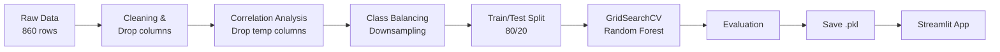

# 🌧️ Rainfall Prediction Web App

Ek machine learning web app jo current weather conditions dekhkar predict karta hai ki **baarish hogi ya nahi**. Model ek tuned **Random Forest Classifier** hai aur interface **Streamlit** se bana hai.

---

## 📌 Workflow



---

## 📁 Project Structure

```
.
├── RNP.py                          # Streamlit web app
├── Rainfall_Predictions.ipynb      # EDA, training & evaluation
├── rainfall_prediction_model.pkl   # Trained model (joblib)
├── images/                         # README visualizations
└── README.md
```

---

## 📊 Exploratory Data Analysis

### Feature Distributions


### Correlation Heatmap
`maxtemp`, `temparature` aur `mintemp` aapas me aur `dewpoint` ke saath bahut highly correlated the, isliye inhe drop kiya gaya.


### Class Balancing
Original data imbalanced tha (587 rain vs 273 no rain). Majority class ko downsample karke dono classes 273-273 kar di gayi.


---

## 🧠 Model Details

| Item | Value |
|---|---|
| Algorithm | Random Forest Classifier |
| Tuning | GridSearchCV (5-fold CV) |
| Best params | `n_estimators=100`, `max_depth=None`, `min_samples_split=5` |
| Train / Test | 436 / 110 samples |

**Features (is order me):** `pressure`, `dewpoint`, `humidity`, `cloud`, `sunshine`, `winddirection`, `windspeed`

### Feature Importance
Model ke hisaab se **sunshine** aur **humidity** sabse important features hain.


---

## 📈 Results

| Metric | Score |
|---|---|
| Mean 5-fold CV accuracy | ~0.78 |
| **Test accuracy** | **0.80** |

### Confusion Matrix


### Precision / Recall / F1


Model baarish pakadne me zyada achha hai (recall 0.88) compared to dry days confirm karne me (recall 0.73).

---

## 🚀 Getting Started

```bash
git clone <your-repo-url>
cd <your-repo-folder>
pip install streamlit numpy pandas joblib scikit-learn==1.6.1
```

> Model **scikit-learn 1.6.1** se save hua tha, isliye same version use karein.

`RNP.py` me hard-coded path ko relative path se badlein:

```python
with open("rainfall_prediction_model.pkl", "rb") as file:
```

App run karein:

```bash
streamlit run RNP.py
```

App `http://localhost:8501` par khulega.

---

## 🖥️ How to Use

1. Sidebar me weather values enter karein.
2. **🔮 Predict Rainfall** button dabayein.
3. Prediction aur rain probability dekhein.

> Sidebar me **Temperature** field hai, lekin model use **nahi** karta (training me temperature columns drop kiye gaye the).

---

## ⚠️ Limitations

- Dataset chhota hai (860 rows, balancing ke baad 546), isliye predictions indicative hain, professional forecast ka replacement nahi.
- Results data ke region/climate par depend karte hain.

## 🔮 Future Improvements

- Unused Temperature input hatana
- XGBoost / Gradient Boosting try karna
- Downsampling ki jagah SMOTE ya class weights
- Bada dataset aur Streamlit Cloud par deployment

---

## 🛠️ Tech Stack

Python · Pandas · NumPy · Scikit-learn · Seaborn · Matplotlib · Joblib · Streamlit

## 👤 Author

Built with ❤️ by **Vishal**
