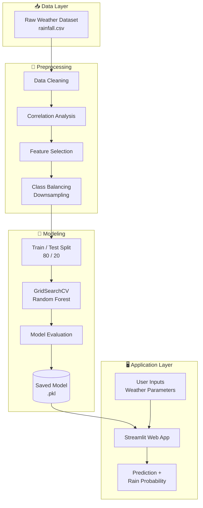

<div align="center">

# 🌧️ Rainfall Prediction Using Machine Learning

### Predict whether it will rain from weather conditions, with an interactive Streamlit app


**Machine Learning · Data Science · Weather Forecasting**

[📊 Results](#-model-performance) · [🚀 Installation](#-installation) · [🖥️ Usage](#️-usage) · [☁️ Deployment](#️-deployment-guide) · [👤 Author](#-author)

</div>

---

## 📑 Table of Contents

- [Project Overview](#-project-overview)
- [Problem Statement](#-problem-statement)
- [Objectives](#-objectives)
- [Key Features](#-key-features)
- [Dataset Information](#-dataset-information)
- [Project Architecture](#-project-architecture)
- [Machine Learning Pipeline](#-machine-learning-pipeline)
- [Exploratory Data Analysis](#-exploratory-data-analysis)
- [Model Performance](#-model-performance)
- [Screenshots](#-screenshots)
- [Installation](#-installation)
- [Usage](#️-usage)
- [Folder Structure](#-folder-structure)
- [Deployment Guide](#️-deployment-guide)
- [Future Enhancements](#-future-enhancements)
- [Author](#-author)
- [License](#-license)

---

## 🔍 Project Overview

**Rainfall Prediction** is an end-to-end machine learning project that predicts whether rainfall will occur on a given day using meteorological parameters such as **pressure, dew point, humidity, cloud cover, sunshine hours, wind speed and wind direction**.

The project covers the complete data science lifecycle: data cleaning, exploratory data analysis (EDA), feature selection, class balancing, hyperparameter tuning, model evaluation, and deployment as an interactive **Streamlit** web application with real-time predictions and rain probability.

## ❓ Problem Statement

Accurate short-term rainfall forecasting supports agriculture, transportation, event planning, and disaster preparedness. Traditional forecasting relies on complex physical models. This project explores a **data-driven approach**: can a machine learning classifier learn the relationship between everyday weather measurements and rainfall occurrence, and expose it through a simple interface for anyone to use?

## 🎯 Objectives

- Predict rainfall occurrence (**Rain / No Rain**) using historical weather data
- Analyze the impact of meteorological factors on rainfall
- Handle class imbalance and multicollinearity through feature selection and resampling
- Optimize model performance with cross-validated hyperparameter tuning
- Deploy the trained model as a real-time prediction web app

## ✨ Key Features

| Feature | Description |
|---|---|
| 📊 Weather Data Analysis | Distribution, correlation and class-balance analysis |
| 🌧️ Rainfall Prediction | Binary classification with rain probability score |
| 📈 Visualizations | Histograms, heatmaps, confusion matrix, metric charts |
| 🧠 Feature Importance | Identifies the strongest rainfall predictors |
| ⚙️ Model Optimization | GridSearchCV with 5-fold cross-validation |
| 🖥️ Real-Time Interface | Streamlit app with sidebar inputs and instant results |

## 🗂️ Dataset Information

| Property | Details |
|---|---|
| Records | 860 daily weather observations |
| Raw columns | 14 (including index columns) |
| Features used | 7 |
| Target variable | `rainfall` (1 = Rain, 0 = No Rain) |
| Missing values | None |
| Class distribution | 587 Rain / 273 No Rain (imbalanced) |
| Source | *Add your dataset link here (e.g., Kaggle)* |

### 📋 Feature Description

| Feature | Type | Description | Used in Model |
|---|---|---|:---:|
| `pressure` | Numeric | Atmospheric pressure (hPa) | ✅ |
| `dewpoint` | Numeric | Temperature at which air becomes saturated (°C) | ✅ |
| `humidity` | Numeric | Relative humidity (%) | ✅ |
| `cloud` | Numeric | Cloud cover (%) | ✅ |
| `sunshine` | Numeric | Hours of sunshine | ✅ |
| `winddirection` | Numeric | Wind direction (degrees, 0–360) | ✅ |
| `windspeed` | Numeric | Wind speed (km/h) | ✅ |
| `maxtemp`, `temparature`, `mintemp` | Numeric | Temperature measures (°C) | ❌ Dropped (high correlation) |
| `id`, `day`, `Unnamed: 0` | Identifier | Index columns | ❌ Dropped |
| `rainfall` | Binary | **Target**: 1 = Rain, 0 = No Rain | 🎯 |

## 🏗️ Project Architecture



## 🔄 Machine Learning Pipeline

| Step | Stage | What Was Done |
|:---:|---|---|
| 1 | **Data Collection** | Loaded daily weather records from CSV |
| 2 | **Data Cleaning** | Stripped column whitespace, removed index columns, verified zero null values |
| 3 | **EDA** | Feature distributions, class balance, correlation heatmap |
| 4 | **Feature Engineering** | Removed `maxtemp`, `temparature`, `mintemp` due to multicollinearity |
| 5 | **Class Balancing** | Downsampled majority class (587 → 273) for a 273 / 273 split |
| 6 | **Train-Test Split** | 80 / 20 split (436 train, 110 test) with `random_state=42` |
| 7 | **Model Training** | Random Forest tuned with GridSearchCV (36 candidates × 5 folds = 180 fits) |
| 8 | **Model Evaluation** | Cross-validation, confusion matrix, classification report |
| 9 | **Deployment** | Model serialized with `joblib` and served via Streamlit |

**Best hyperparameters:** `n_estimators=100`, `max_depth=None`, `min_samples_split=5`

## 📊 Exploratory Data Analysis

### Feature Distributions
<p align="center">
  
</p>

### Correlation Heatmap
<p align="center">
  
</p>

### Class Balancing
<p align="center">
  
</p>

### 💡 Key EDA Insights

- 🌡️ **Temperature columns are redundant**: `maxtemp`, `temparature` and `mintemp` are strongly correlated with each other and with `dewpoint`, so they were removed to reduce multicollinearity.
- ⚖️ **The target is imbalanced**: rainy days outnumber dry days roughly 2:1, so the classes were balanced to avoid a model biased toward "Rain".
- ✅ **The data is clean**: no missing values were found.
- ☁️ **Humidity, cloud cover and sunshine** carry strong signal for rainfall, as confirmed by feature importance below.

### Feature Importance
<p align="center">
  
</p>

> **Sunshine** and **humidity** are the most influential predictors, which is consistent with meteorological intuition: less sunshine and higher humidity indicate wetter days.

## 🏆 Model Performance

### Model Comparison

| Model | Accuracy | Precision | Recall | F1 Score | ROC-AUC |
|---|:---:|:---:|:---:|:---:|:---:|
| **Random Forest (tuned)** ⭐ | **0.80** | **0.81** (macro) | **0.81** (macro) | **0.80** | 🔜 |
| Logistic Regression | 🔜 | 🔜 | 🔜 | 🔜 | 🔜 |
| Decision Tree | 🔜 | 🔜 | 🔜 | 🔜 | 🔜 |
| Gradient Boosting | 🔜 | 🔜 | 🔜 | 🔜 | 🔜 |
| XGBoost | 🔜 | 🔜 | 🔜 | 🔜 | 🔜 |

> 🔜 = planned. The current release ships the tuned Random Forest. Benchmarks for the remaining algorithms and ROC-AUC are on the [roadmap](#-future-enhancements). Cross-validation accuracy for Random Forest: **~0.78** (5-fold).

### Per-Class Results (Random Forest, Test Set)

| Class | Precision | Recall | F1 Score | Support |
|---|:---:|:---:|:---:|:---:|
| No Rain (0) | 0.88 | 0.73 | 0.80 | 59 |
| Rain (1) | 0.74 | 0.88 | 0.80 | 51 |

<p align="center">
  
  
</p>

> The model has high **recall for rain (0.88)**, meaning it rarely misses rainy days, a useful property for a "carry an umbrella" use case.

## 📸 Screenshots

> Add your own screenshots to a `screenshots/` folder and update the file names below.

| Home Page | Prediction: Rain | Prediction: No Rain |
|:---:|:---:|:---:|
|  |  |  |

## 🚀 Installation

### Prerequisites
- Python 3.9 or higher
- pip

### Steps

```bash
# 1. Clone the repository
git clone https://github.com/<your-username>/rainfall-prediction.git
cd rainfall-prediction

# 2. (Optional) Create a virtual environment
python -m venv venv
source venv/bin/activate        # Windows: venv\Scripts\activate

# 3. Install dependencies
pip install -r requirements.txt
```

> ⚠️ The model was trained with **scikit-learn 1.6.1**. Use the pinned version in `requirements.txt` to avoid `InconsistentVersionWarning`.

## 🖥️ Usage

### Run the Web App

```bash
streamlit run RNP.py
```

Open **http://localhost:8501** in your browser.

1. Enter weather parameters in the sidebar
2. Click **🔮 Predict Rainfall**
3. View the prediction and rain probability

### Use the Model in Python

```python
import joblib
import pandas as pd

model = joblib.load("rainfall_prediction_model.pkl")

sample = pd.DataFrame([{
    "pressure": 1015.9, "dewpoint": 17.8, "humidity": 97,
    "cloud": 86, "sunshine": 0.0, "winddirection": 40.0, "windspeed": 13.7
}])

print("Rain" if model.predict(sample)[0] == 1 else "No Rain")
print(f"Probability of rain: {model.predict_proba(sample)[0][1]:.1%}")
```

### Explore the Notebook

```bash
jupyter notebook Rainfall_Predictions.ipynb
```

## 📁 Folder Structure

```
rainfall-prediction/
│
├── 📓 Rainfall_Predictions.ipynb      # EDA, training and evaluation
├── 🖥️ RNP.py                          # Streamlit web application
├── 🤖 rainfall_prediction_model.pkl   # Trained Random Forest model
├── 📄 requirements.txt                # Python dependencies
├── 📖 README.md
│
├── 🖼️ images/                         # EDA and result visualizations
│   ├── feature_distributions.png
│   ├── correlation_heatmap.png
│   ├── class_balancing.png
│   ├── feature_importance.png
│   ├── confusion_matrix.png
│   └── classification_metrics.png
│
└── 📸 screenshots/                    # App screenshots
```

## ☁️ Deployment Guide

### Deploy on Streamlit Community Cloud (Free)

1. **Fix the model path** in `RNP.py` so it works outside your local machine:
   ```python
   with open("rainfall_prediction_model.pkl", "rb") as file:
       model = joblib.load(file)
   ```
2. Push the project (including `requirements.txt` and the `.pkl` file) to a **public GitHub repository**.
3. Go to [share.streamlit.io](https://share.streamlit.io) and sign in with GitHub.
4. Click **New app**, select your repository, branch `main`, and main file `RNP.py`.
5. Click **Deploy**. Your app will be live at a public URL.

### Deploy with Docker (Optional)

```dockerfile
FROM python:3.11-slim
WORKDIR /app
COPY requirements.txt .
RUN pip install --no-cache-dir -r requirements.txt
COPY . .
EXPOSE 8501
CMD ["streamlit", "run", "RNP.py", "--server.port=8501", "--server.address=0.0.0.0"]
```

```bash
docker build -t rainfall-prediction .
docker run -p 8501:8501 rainfall-prediction
```

## 🔮 Future Enhancements

- [ ] Benchmark **Logistic Regression, Decision Tree, Gradient Boosting and XGBoost** against Random Forest
- [ ] Add **ROC-AUC** curves and precision-recall analysis
- [ ] Replace downsampling with **SMOTE** or class weights to retain more training data
- [ ] Add engineered features (e.g., temperature-dew point spread, humidity × cloud interaction)
- [ ] Train on a larger, multi-region dataset
- [ ] Add **SHAP** explanations for individual predictions
- [ ] Integrate a live weather API for automatic input
- [ ] Add unit tests and a CI/CD pipeline with GitHub Actions
- [ ] Remove the unused Temperature field from the app sidebar

## 👤 Author

**Vishal**

[](https://github.com/your-username)
[](https://linkedin.com/in/your-profile)
[](mailto:your-email@example.com)

*Open to opportunities in Data Analytics, Data Science, Machine Learning and AI Engineering.*

## 📄 License

This project is licensed under the **MIT License**. See the [LICENSE](LICENSE) file for details.

---

<div align="center">

⭐ **If you found this project useful, please give it a star!** ⭐

Built with ❤️ Vishal Kumar using Python and Scikit-Learn

</div>

